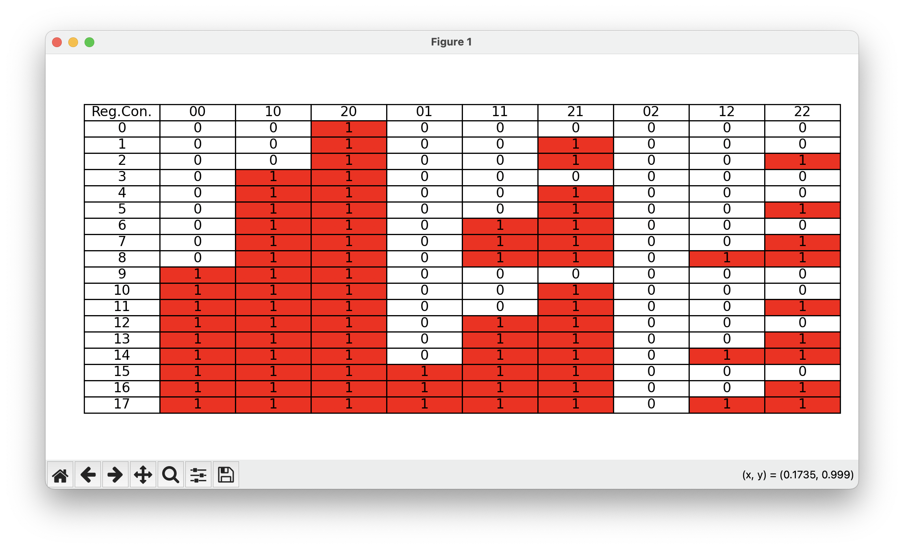

## Biological Computation - Final Project

We wrote a computer program in Python ('main.py') that finds all the monotonic regulation conditions of the reasoning engine.
The data represented all the possible regulation conditions and was inserted into a CSV file ('all_posible_regulation_conditions.csv').

The program checks each regulation condition and determines whether it is monotonic or not, according to these conditions:

1. More activators (or fewer inhibitors) should not decrease the output.
2. More inhibitors (or fewer activators) should not increase the output.

The program defines pairs of states, in which there was a change in the state of one activator/inhibitor.\
For every regulation condition, the program scans through all the pairs of states and checks whether the condition fulfills the criteria of monotonicity.

Finally, the program collects all the matching conditions and plots them on a table.

### How to run this program
First, clone this repository to your machine in your desired folder

```bash
git init
git clone https://github.com/YuvalDisatnik/BiologicalComputationProject.git
cd BiologicalComputationProject
```

You will need to create a virtual environment and download the needed dependencies.\
In the same folder of your project, type:
```bash
python -m venv myvenv

# For Linux / Mac machines:
source myvenv/bin/activate

# For windows:
myvenv\Scripts\activate

pip install -r requirements.txt
```
And finally, run the program
```python
python main.py
```

### Output
As mentioned above, the output of the program will be a new window contacting a table, which includes all the monotonic regulation conditions:

